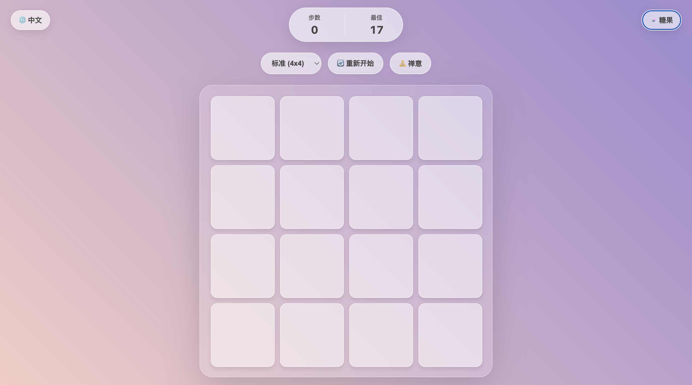
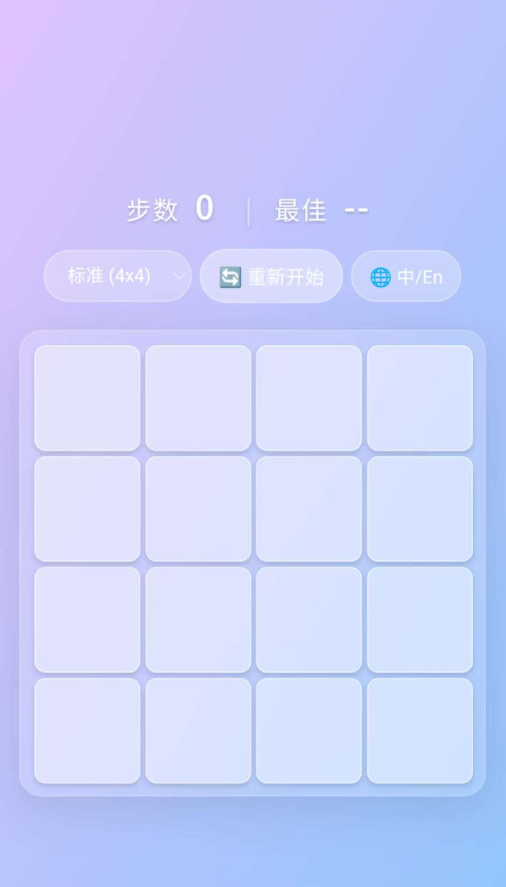

# 🌿 Memory Zen

  

> **"Code is poetry, and memory is a landscape."**

**[English](#-english) | [中文说明](#-中文说明)**

---

## 🇬🇧 English

### Introduction
**Memory Zen** is a lightweight, meditative memory card game built with pure HTML, CSS, and JavaScript. 
It features **zero image assets** (everything is rendered by code) and an **adaptive responsive design** that works perfectly on any device.

### 🎮 Play Now
👉 **[Click Here to Start the Game](https://yyhh-cloud.github.io/memory-zen/)**
*(Recommended on Mobile for the best experience)*

### ✨ Key Features
* **🎨 Pure CSS Landscapes**: No external images! All 5 immersive themes (Morning, Ocean, Aurora, Dusk, Forest) are rendered via CSS gradients.
* **📱 Adaptive Layout**: Powered by a smart algorithm using `clamp()` and Grid. It perfectly fits screens from 4K desktops to small phones.
* **🌐 Bilingual UI**: Built-in i18n support. Switch between English and Chinese with one click.
* **🧘 Zen Design**: Glassmorphism UI + Morandi colors for a relaxing experience.

### 🛠️ Tech Stack
* **Core**: HTML5, CSS3, Vanilla JS (ES6+)
* **Layout**: CSS Grid, Flexbox
* **Effects**: CSS 3D Transforms, Animations
* **Storage**: LocalStorage API

### 🚀 How to Run
No dependencies. No build tools.
1.  Clone the repo: `git clone https://github.com/yyhh-cloud/memory-zen.git`
2.  Open `index.html` in your browser.

---

## 🇨🇳 中文说明

### 项目简介
**Memory Zen (禅意翻牌)** 是一款轻量级、主打沉浸体验的网页小游戏。
该项目完全使用原生 HTML/CSS/JS 编写，**不依赖任何图片资源**（全代码绘制），并拥有**极致的响应式设计**，无论是电脑还是手机都能获得完美的视觉体验。

### 🎮 在线试玩
👉 **[点击这里开始游戏](https://yyhh-cloud.github.io/memory-zen/)**
*(推荐使用手机访问，体验最佳)*

### ✨ 核心亮点
* **🎨 纯 CSS 画廊**：告别图片加载失败！晨曦、深海、极光等 5 套主题全由 CSS 渐变与动画实时渲染。
* **📱 全屏自适应**：独创的布局算法。在 6x6 极限模式下，卡片间距、大小、字体会自动缩放，绝不溢出屏幕。
* **🌐 中英双语**：内置国际化支持，游戏内可一键切换中英文界面。
* **🧘 禅意美学**：采用莫兰迪配色与高级毛玻璃（Glassmorphism）特效，护眼又解压。

### 🛠️ 技术栈
* **核心**：原生 HTML5, CSS3, JavaScript (ES6+)
* **布局**：CSS Grid (网格), Flexbox (弹性盒)
* **特效**：CSS 3D 翻转, 关键帧动画, 背景滤镜
* **存储**：LocalStorage (本地记录最佳成绩)

### 🚀 本地运行
本项目无任何依赖，无需 Node.js 环境。
1.  克隆仓库：`git clone https://github.com/yyhh-cloud/memory-zen.git`
2.  双击 `index.html` 即可运行。

---

## 📸 Screenshots / 截图预览

| Desktop (Zen Mode) | Mobile (Pink Theme) |
|:---:|:---:|
|  |  |

---

## 📄 License

MIT License.

  Created with ❤️ by <strong> yy </strong> 
  <em>Enjoy the Zen moment. 🌿</em>

